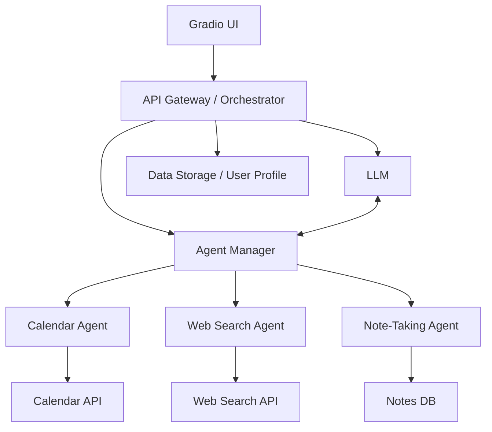

# GenAI-Empowered-Personal-Assistant

Here's a high-level architecture design for an AI personal assistant with the specified requirements. This design highlights core components, their responsibilities, and how they interact, focusing on extensibility and modularity.

## High-Level Architecture Overview

### 1. Gradio UI
- **Purpose:** User interaction interface (text, voice, uploads).
- **Role:** Captures user queries and displays results, serving as the main entry and exit point for all interactions.

### 2. API Gateway / Orchestrator
- **Purpose:** Central coordinator for incoming UI requests.
- **Role:** Routes user inputs to the appropriate agents or modules. Handles session management, state tracking, and response aggregation.

### 3. Agent Management (strands-agents)
- **Purpose:** Manage and execute different AI agents, encapsulate skills/tasks.
- **Key Agents:**
  - **Calendar Agent:** Interfaces with calendar APIs (Google, Outlook) to fetch/add events, send reminders, etc.
  - **Web Search Agent:** Utilizes APIs or web scraping to answer factual or open-domain questions.
  - **Note-Taking Agent:** Stores, retrieves, and organizes user notes, possibly supporting tagging and search.
  - **Other Agents:** Extensible for future capabilities (e.g., email, todo lists, notifications).

- **Interaction:** The orchestrator invokes relevant agents via the strands-agents framework, optionally combining outputs.

### 4. Large Language Model (lln via ollama)
- **Purpose:** Natural language understanding, reasoning, and response synthesis.
- **Role:** Handles conversation, multi-turn dialogue, summarization, and natural language queries. Acts as the core engine interpreting user intent and generating structured actions for agents.

### 5. Data Storage
- **Purpose:** Persist user-specific data.
- **Types:**
  - **Notes Database:** For persistent note management (NoSQL or SQL).
  - **User Profile & Preferences:** Stores settings, permissions, authentication tokens.
  - **Session State:** Holds temporary context for ongoing conversations.

### 6. External Integrations
- **APIs for:** Calendar (Google/Outlook), web search (Bing/Google), other productivity tools.
- **Purpose:** Enable assistant functionalities by connecting to outside services securely.

## Component Interaction Diagram

## Key Functional Flows

### Calendar Management
1. User issues a request (e.g., “Add a meeting tomorrow at 3pm with Alex.”).
2. Gradio UI sends to Orchestrator.
3. Orchestrator forwards to LLM, which parses intent (add calendar event).
4. Orchestrator executes the Calendar Agent via the agent framework.
5. Calendar Agent interacts with Calendar API and returns success or error.
6. LLM generates a human-friendly response, returned to Gradio UI.

### Web Search
1. User asks, “What’s the weather in Paris?”
2. Same flow as above, routed to Web Search Agent, which fetches real-time data.

### Note-Taking
1. User says, “Remember to buy milk.”
2. Routed to Note-Taking Agent, which stores the note in database.
3. Retrieval uses similar pipeline, with LLM managing phrasing.

## Summary Table

| Component                | Technology         | Responsibility                        |
|--------------------------|-------------------|----------------------------------------|
| UI                       | Gradio            | User input/output                      |
| Orchestration            | Python/Backend    | Routing, state mgmt, API coordination  |
| Agents                   | strands-agents    | Task-specific logic                    |
| Language Model           | lln via ollama    | Natural language processing            |
| Data Storage             | SQL/NoSQL         | Notes, preferences, state              |
| External APIs            | Respective APIs   | Calendar, search, productivity tools   |

### Design Highlights

- **Modularity:** Add/remove agents without changing the core pipeline.
- **Scalability:** Components can run in containers/microservices.
- **Extensibility:** Easy integration of new agent types or AI models.
- **User-Centric:** Interface and personalization built-in from the start.
